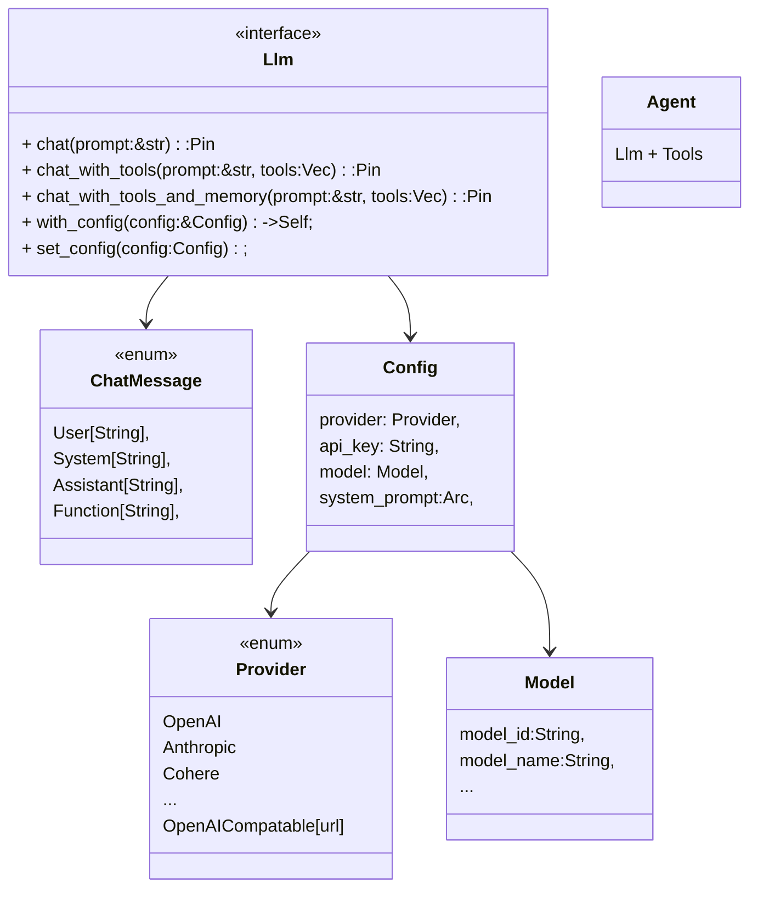

```mermaid
classDiagram
    class Llm {
        <<interface>>
        + chat(prompt:&str):Pin
        + chat_with_tools(prompt:&str, tools:Vec):Pin
        + chat_with_tools_and_memory(prompt:&str, tools:Vec):Pin
        + with_config(config:&Config)->Self;
        + set_config(config:Config);
    }
    class Provider{
        <<enum>>
        OpenAI
        Anthropic
        Cohere
        ...
        OpenAICompatable[url]
    }
    class Model{
        model_id:String,
        model_name:String,
        ...
    }
    class ChatMessage{
        <<enum>>
        User[String],
        System[String],
        Assistant[String],
        Function[String],
    }
    class Config {
        provider: Provider,
        api_key: String,
        model: Model,
        system_prompt:Arc,
    }
    Llm --> Config
    Config --> Provider
    Config --> Model
    Llm --> ChatMessage

    class Agent{
        Llm + Tools
    }
```