<p align="center">
  <picture>
    <source media="(prefers-color-scheme: dark)" srcset="https://img.shields.io/badge/workflow-runtime-8B5CF6?style=for-the-badge&logo=rust&logoColor=white">
    
  </picture>
</p>

<p align="center">
  <b>Multi-agent orchestration runtime with hierarchical delegation,<br>experience-driven learning, and sandboxed tool execution.</b>
</p>

<p align="center">
  <a href="https://www.rust-lang.org"></a>
  <a href="https://github.com/WorkflowTeam/workflow/blob/main/LICENSE"></a>
  
  
</p>

---

## Overview

**Workflow** is a Rust-native agentic runtime that orchestrates swarms of LLM-powered agents to decompose, delegate, and execute complex missions. It combines a multi-layer decision pipeline, a DAG-based task graph, experience-driven learning via semantic embeddings, and a sandboxed tool system — all surfaced through a rich terminal UI.

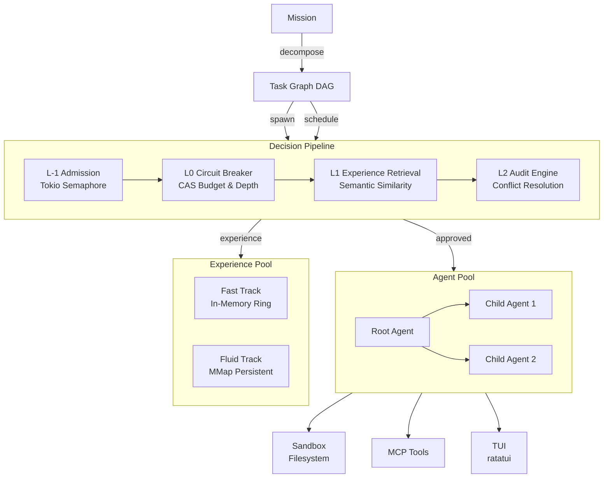

## Architecture

### Decision Pipeline

Every agent spawn request passes through a four-layer decision gate:

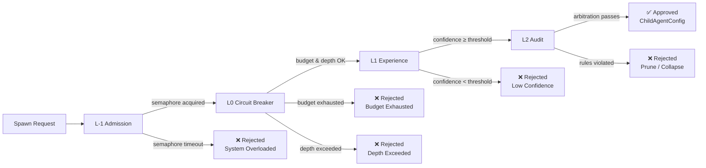

| Layer | Gate | Mechanism | Rejection |
|-------|------|-----------|-----------|
| **L-1** | Admission Control | Tokio `Semaphore` — caps concurrent agents | `SystemOverloaded` |
| **L0** | Circuit Breaker | CAS atomics on budget, depth, tool bitmap | `BudgetExhausted`, `DepthExceeded`, `ResourceConflict` |
| **L1** | Experience Retrieval | Cosine similarity (AVX2+FMA) against 384-d embeddings | `L1Rejected` with confidence score |
| **L2** | Audit Engine | Rules + priority scoring with automatic collapse | `Prune`, `Override`, `L2Collapsed` |

### Task Graph (DAG)

Missions are decomposed into a directed acyclic graph with a formal state machine:

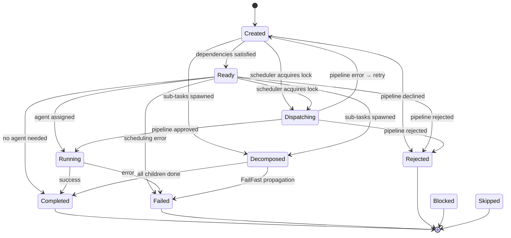

Key properties:

- **Parent/children** = decomposition hierarchy (who spawned whom)
- **Dependencies** = execution ordering (what must finish first)
- **FailurePolicy::FailFast** — a child failure immediately marks the parent `Failed` and propagates upward
- **Dispatching** — anti-double-dispatch lock preventing duplicate scheduling

### Agent Lifecycle

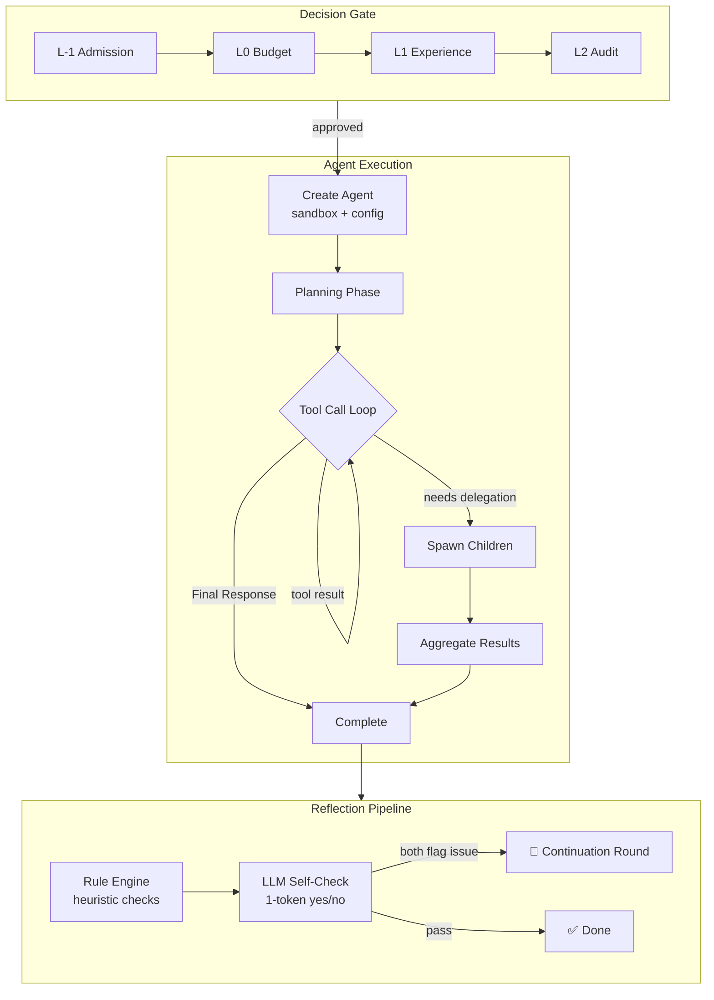

### Experience Pool (Dual-Track Memory)

Two parallel memory tracks work in concert — one ephemeral and fast, one durable and clustered:

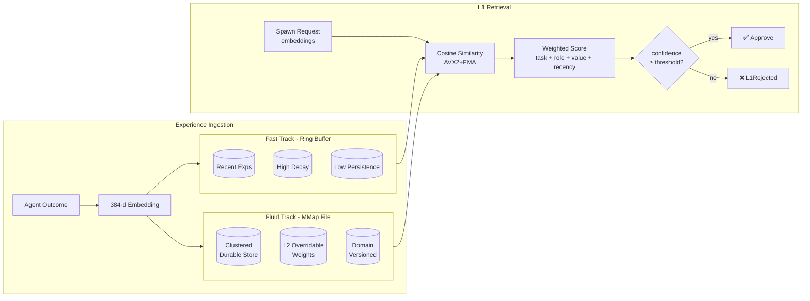

| Track | Backing | Decay | Persistence | L2 Override |
|-------|---------|-------|-------------|-------------|
| **Fast** | In-memory `Vec` ring buffer | High | None | No |
| **Fluid** | `mmap` + binary file | Low | Durable | Yes — boosts weight ×1.5 |

The L1 retriever scores incoming spawn requests using SIMD-accelerated cosine similarity (AVX2+FMA) against 384-d embeddings, combining four weighted factors: task similarity, role similarity, value alignment, and temporal recency.

### Sandboxed Tool System

Every agent gets an isolated filesystem sandbox with copy-on-write semantics:

```mermaid
flowchart TB
    subgraph Host[Host Filesystem]
        Project[/project]
        SandboxDir[~/.workflow/sandbox/]
    end

    subgraph AgentSandbox[Agent Sandbox<br/>agent_id:8]
        Work[work/<br/>writable]
        Src[src → /project<br/>read-only symlink]
    end

    SandboxDir --- AgentSandbox
    Src -.->|symlink| Project

    subgraph Tools[Tool Resolution]
        Write[write /work/...] --> Allow[✅ Allowed]
        Read[read /src/...] --> Allow
        Escape[.../../escape] --> Block[❌ Blocked]
        Outside[write /project/...] --> Block
    end
```

Path traversal, symlink escapes leaving the project root, and writes to the source tree are all blocked. Tool catalog:

| Category | Tools |
|----------|-------|
| **Built-in** | `read`, `write`, `search`, `grep`, `glob`, `shell`, `diff_edit` |
| **Agent** | `spawn_child`, `send_message`, `read_messages`, `list_agents`, `search_asset` |
| **Memo** | `memo_write`, `memo_read`, `memo_list` — per-role scratchpad |
| **MCP** | Full `ToolServer` with streaming, tool chaining, and `ToolDyn` dynamic dispatch |

### Structured Reflection

A two-stage quality gate fires after every agent completion. Lightweight rules run first; only if they flag a problem does the LLM spend a token on self-verification:

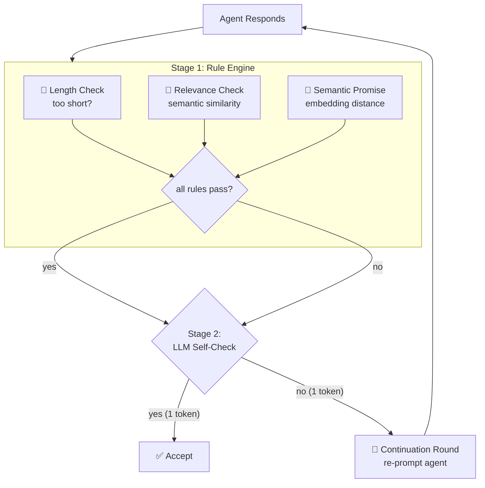

### Persistence & Checkpointing

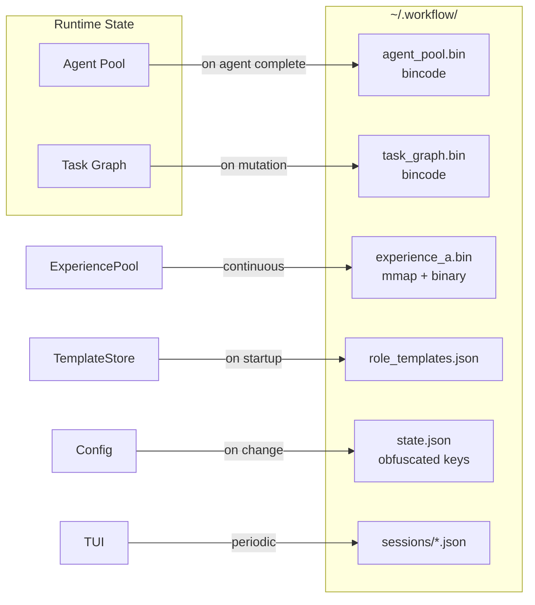

| Component | Format | Trigger | Recovery |
|-----------|--------|---------|----------|
| Agent Pool | `bincode` | Each agent completion | Full restore on restart |
| Task Graph | `bincode` | After each mutation | Rebuilt from checkpoint |
| Experience Pool | `mmap` + binary | Continuous (dual-track) | Instant — mmap persists in kernel |
| Role Templates | JSON | Read at startup | Missing file → seed defaults |
| State | JSON (XOR-obfuscated keys) | Config change | Graceful fallback |
| Session Logs | JSON | Periodic autosave | Chat history on TUI restart |

### Terminal UI

Built with [ratatui](https://github.com/ratatui/ratatui), the TUI provides a split-panel real-time cockpit:

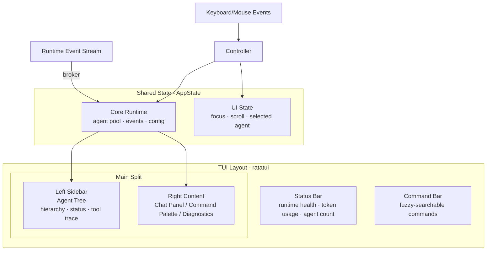

## Crate Map

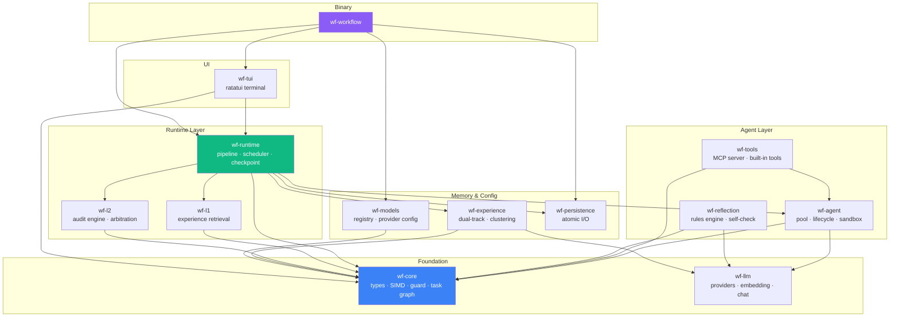

## Getting Started

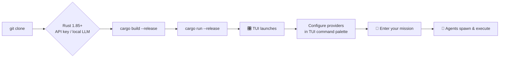

```bash
# Build
cargo build --release

# Run
cargo run --release

# CI gates
./ci.sh
```

### Prerequisites

- Rust 1.85+ (edition 2024)
- An LLM provider API key (OpenAI, Anthropic, etc.) or a local Ollama/Llamafile instance

### Configuration

Provider keys and model selection are configured through the TUI or persisted in `~/.workflow/state.json`. Keys can be stored in obfuscated form (XOR with machine ID) for casual security.

```bash
# Set environment variables for API keys
export OPENAI_API_KEY="sk-..."
export ANTHROPIC_API_KEY="sk-ant-..."
```

## CI Gates

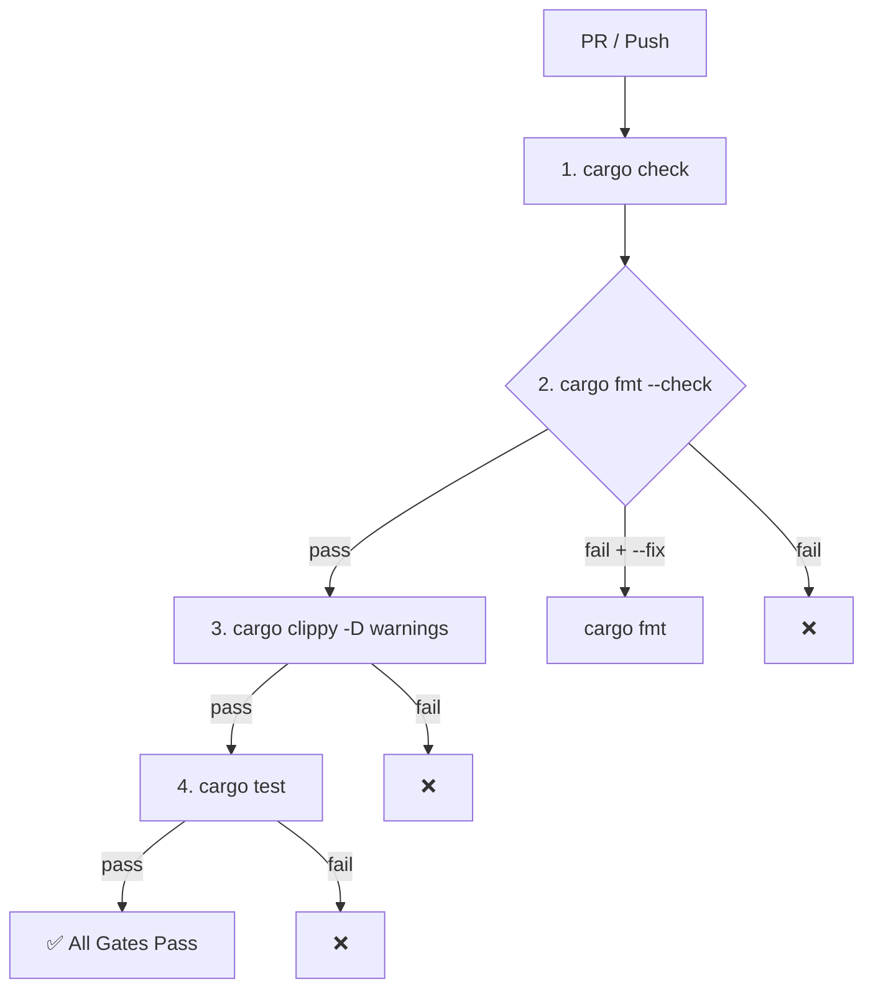

| Gate | Command | Fail exit |
|------|---------|-----------|
| `cargo check` | `cargo check` | 1 |
| `cargo fmt` | `cargo fmt --check` (auto-fix via `--fix`) | 1 |
| `cargo clippy` | `cargo clippy -- -D warnings` | 1 |
| `cargo test` | `cargo test` | 1 |

## Design Principles

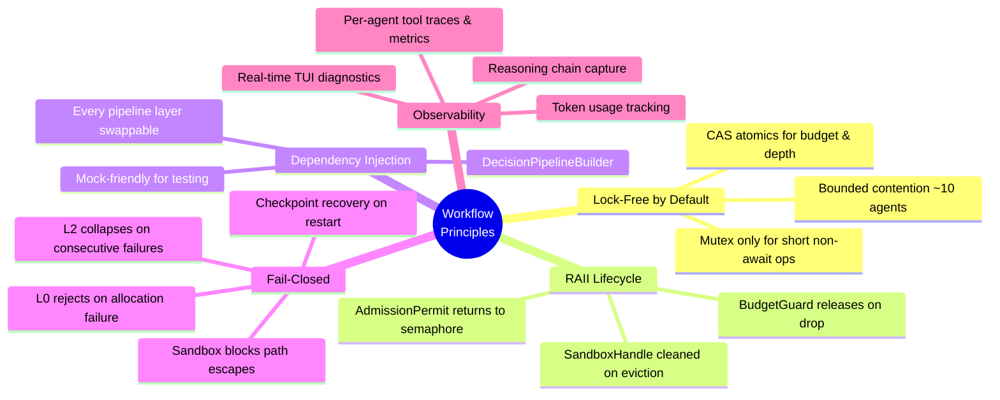

1. **Lock-free by default** — shared state uses CAS atomics; `Mutex` only for short, non-`.await`-held operations
2. **RAII resource lifecycle** — budget permits, admission slots, and sandbox handles all release on drop
3. **Dependency injection** — every pipeline layer can be swapped (mocks, custom audit engines, etc.)
4. **Fail-closed** — L0 rejects on allocation failure, L2 collapses on consecutive audit failures, sandbox rejects on path escape
5. **Observability** — every agent records tool traces, token usage, metrics, and reasoning for TUI diagnostics

## License

MIT — see [LICENSE](LICENSE).

---

<p align="center">
  <sub>Built with Rust, tokio, ratatui, rig, and fastembed.</sub>
</p>
