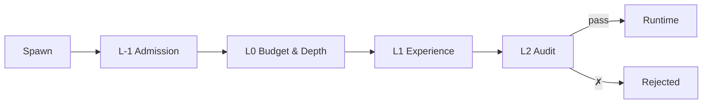

# Workflow

**Multi-agent AI orchestration — gates before agents.**

[](#)
[](#)
[](https://github.com/Yoimiya-Naganohara/workflow/actions/workflows/ci.yml)

Every agent framework trusts then verifies: let the LLM run, clean up the mess.
Workflow inverts that. Four independent gates evaluate every spawn before a
single token is spent. One rejection means the agent never exists.

```rust
let runtime = AgentRuntime::new(config, embedding).await;

match runtime.spawn_agent(request).await {
    Ok(agent_id) => { /* cleared all gates */ }
    Err(SpawnRejection::L1Rejected { reason, confidence }) =>
        log::warn!("L1 confidence {confidence:.2} below threshold: {reason}"),
    Err(SpawnRejection::BudgetExhausted { requested, remaining }) =>
        log::error!("budget: need {requested}, have {remaining}"),
    Err(SpawnRejection::DepthExceeded { current, max }) =>
        log::error!("depth {current} exceeds limit {max}"),
    Err(e) => log::error!("spawn failed: {e}"),
}
```

---

**Architecture > prompts.** Four gates enforce hard constraints — concurrency,
budget, experiential learning, and conflict policy. Every gate is a Rust trait;
swap any layer without touching the runtime.



| Layer | Stops | Mechanism |
|-------|-------|-----------|
| **L-1** | Concurrency overload | Tokio semaphore |
| **L0** | Budget drain / infinite recursion | CAS atomic counters |
| **L1** | Repeating past failures | 384-d cosine similarity vs experience pool |
| **L2** | Resource conflicts | Rule engine, optional LLM override |

### Crates

| Crate | Purpose |
|-------|---------|
| `wf-core` | Types, SIMD cosine sim, constants, task graph DAG |
| `wf-llm` | LLM provider abstraction — 9 backends via [`rig`](https://github.com/0xPlaygrounds/rig) |
| `wf-l1` | Experience-based confidence assessment |
| `wf-l2` | Rule audit engine, collapse recovery, arbitration |
| `wf-models` | Model registry, provider config, cost tracking |
| `wf-agent` | Agent pool, plan registry, sandbox, memos |
| `wf-experience` | mmap-backed bedrock + volatile fluid dual-track memory |
| `wf-tools` | MCP tools — ReadFile, WriteFile, Shell, DiffEdit, search, messaging |
| `wf-reflection` | Heuristic rules + single-token LLM self-check |
| `wf-persistence` | State serialization, key store |
| `wf-runtime` | Pipeline wiring, scheduler, lifecycle, checkpoint/restore |
| `wf-tui` | Terminal UI (ratatui + crossterm) |
| `wf-workflow` | Binary — TUI or `--cli` |

---

### Quickstart

**Prerequisites:**
- Rust 1.85+
- An LLM provider — set via environment or config file

| Provider   | Env Variable         | Example Value             |
|------------|----------------------|---------------------------|
| OpenAI     | `OPENAI_API_KEY`     | `sk-...`                  |
| Anthropic  | `ANTHROPIC_API_KEY`  | `sk-ant-...`              |
| Ollama     | `OLLAMA_BASE_URL`    | `http://localhost:11434`  |
| Gemini     | `GEMINI_API_KEY`     | `AIza...`                 |

```bash
cargo build --release
cargo run --release          # TUI (default)
cargo run --release -- --cli # headless
./ci.sh                      # check, fmt, clippy, test, docs
```

### Key ideas

**Presumed guilty.** Agents don't run and get audited after. They request
permission. The pipeline decides. A rejection at any gate is final.

**Task graph DAG.** Tracks spawn hierarchy, execution ordering, and failure
propagation. `Created → Ready → Running → Completed | Failed | Rejected`.

**Dual-track memory.** mmap-backed **bedrock** pool survives restarts.
Volatile bounded **fluid** pool for fast writes. Clustering promotes
representative fluid entries into bedrock.

**Sandbox.** Each agent gets `~/.workflow/sandbox/{id}/work/` (writable) +
`src/` (read-only symlink to project root). Escape-proof path resolution.

**9 LLM backends.** OpenAI, Anthropic, Gemini, Ollama, Cohere, Mistral, Azure,
LlamaFile, Copilot — swap at runtime, no API rewrites.

---

### Project structure

```
crates/
├── wf-core/          # Core types, SIMD, constants, task graph DAG
├── wf-llm/           # LLM provider abstraction — 9 backends
├── wf-l1/            # L1 experience-based confidence assessment
├── wf-l2/            # L2 rule audit engine, collapse recovery
├── wf-models/        # Model registry, provider config, cost tracking
├── wf-agent/         # Agent pool, plan registry, sandbox, memos
├── wf-experience/    # Dual-track memory (bedrock + fluid)
├── wf-tools/         # MCP tool implementations
├── wf-reflection/    # Heuristic rules + LLM self-check
├── wf-persistence/   # State serialization & key store
├── wf-runtime/       # Pipeline wiring, scheduler, lifecycle
├── wf-tui/           # Terminal UI (ratatui + crossterm)
└── wf-workflow/      # Binary entrypoint
```

---

### Configuration

```rust
AgentRuntimeConfig {
    max_concurrent_agents: 10,     // L-1 cap
    admission_timeout_ms: 100,     // L-1 wait timeout
    max_depth: 5,                  // L0 spawn depth limit
    initial_budget: 10_000,        // L0 token budget
    l1_confidence_threshold: 0.5,  // L1 confidence floor
    semantic_conflict_threshold: -0.6, // L2 conflict boundary
    suspend_timeout_ms: 50,        // suspend queue timeout
    bedrock_path: None,            // ~/.workflow/experience_a.bin
    role_template_path: None,      // ~/.workflow/role_templates.json
}
```

See [`wf-core/src/constants.rs`](crates/wf-core/src/constants.rs) for tunable
constants — `EMBEDDING_DIM` (384), `DEFAULT_MAX_DEPTH` (5), `MAX_CONSECUTIVE_FAILURES` (5),
`L2_OVERRIDE_BOOST` (1.5).

### Status

| Phase | Focus |
|-------|-------|
| 1 | Task graph DAG delegation |
| 2 | Runtime analytics & optimization |
| 3 | Inter-agent messaging & tool tracing |
| 4 | Security audit & production hardening |

---

### Contributing

PRs welcome! All contributions go through the same four gates:

1. **`cargo check`** — must compile cleanly
2. **`cargo fmt --check`** — must be formatted (`./ci.sh --fix` to auto-fix)
3. **`cargo clippy -- -D warnings`** — no new warnings
4. **`cargo test`** — all tests pass

Run `./ci.sh` locally before pushing.

See the [Phase roadmap](#status) above — if you're tackling something on it,
mention it in the PR description.

### License

MIT — see [LICENSE](LICENSE).
