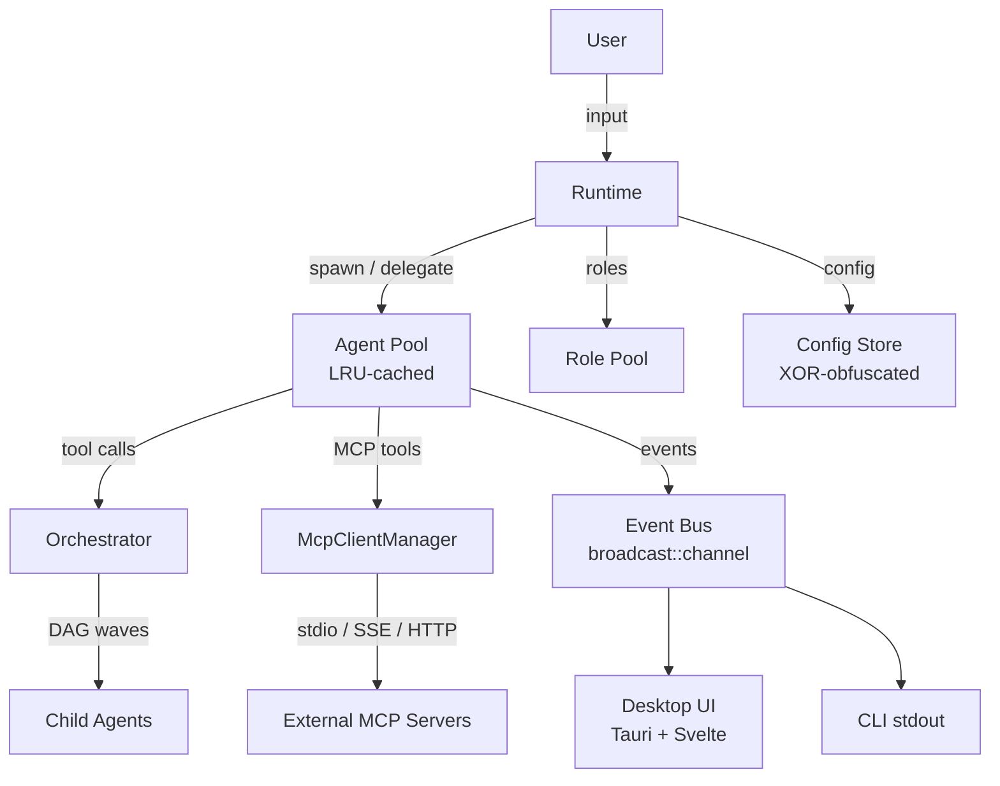
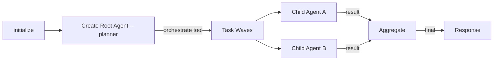
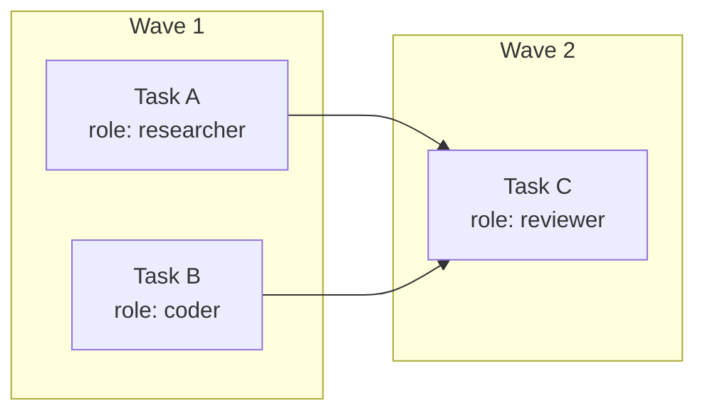
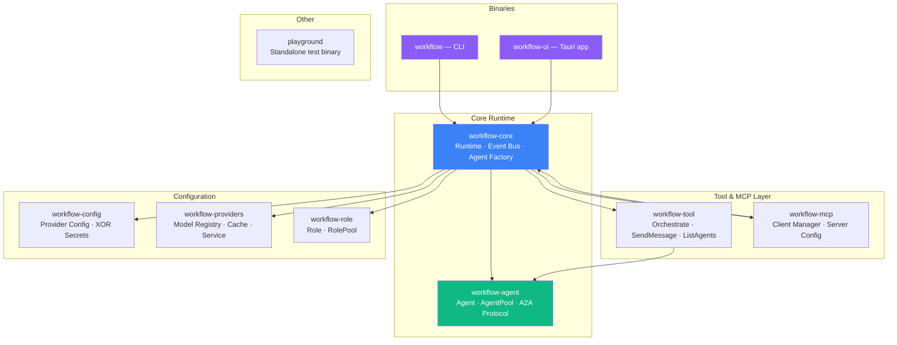

<p align="center">
  <picture>
    <source media="(prefers-color-scheme: dark)" srcset="https://img.shields.io/badge/workflow-runtime-8B5CF6?style=for-the-badge&logo=rust&logoColor=white">
    
  </picture>
</p>

<p align="center">
  <b>Multi-agent orchestration runtime with hierarchical delegation,<br>role-based agent pools, MCP tool integration, and a Tauri desktop UI.</b>
</p>

<p align="center">
  <a href="https://www.rust-lang.org"></a>
  <a href="https://github.com/WorkflowTeam/workflow/blob/main/LICENSE"></a>
  
  
</p>

---

## Overview

**Workflow** is a Rust-native agentic runtime that orchestrates swarms of LLM-powered agents to decompose, delegate, and execute complex missions. It combines a role-based agent pool, a DAG-based task orchestrator, MCP (Model Context Protocol) tool integration, and a rich Tauri desktop UI.


```mermaid
flowchart TB
    User -->|input| Runtime[Runtime]
    Runtime -->|spawn / delegate| AgentPool[Agent Pool<br/>LRU-cached]
    Runtime -->|roles| RolePool[Role Pool]

    AgentPool -->|tool calls| Orchestrate[Orchestrator]
    Orchestrate -->|DAG waves| ChildAgents[Child Agents]

    AgentPool -->|MCP tools| MCP[McpClientManager]
    MCP -->|stdio / SSE / HTTP| External[External MCP Servers]

    AgentPool -->|events| Events[Event Bus<br/>broadcast::channel]
    Events --> UI[Desktop UI<br/>Tauri + Svelte]
    Events --> CLI[CLI stdout]

    Runtime -->|config| Config[Config Store<br/>XOR-obfuscated]
```

## Architecture

### Runtime

The [`Runtime`](crates/core/src/lib.rs) is the central coordinator. It owns:
- **AgentPool** — an LRU-cached pool of running agents with lifecycle management
- **RolePool** — a registry of named roles (e.g. `planner`, `executor`, `coder`) each with a system prompt definition
- **Event Bus** — a Tokio `broadcast::channel` that delivers agent events to consumers (CLI, TUI, etc.)
- **McpClientManager** — manages connections to external MCP servers and registers their tools
- **ToolServer** — a `rig::tool::server::ToolServerHandle` exposing built-in and MCP tools to every agent
- **Message Store** — per-agent conversation history


```mermaid
flowchart LR
    Init[initialize] --> RootAgent[Create Root Agent -- planner]
    RootAgent -->|orchestrate tool| Waves[Task Waves]
    Waves --> Child1[Child Agent A]
    Waves --> Child2[Child Agent B]
    Child1 -->|result| Aggregate[Aggregate]
    Child2 -->|result| Aggregate
    Aggregate -->|final| Response[Response]
```

### Agent Lifecycle

Agents are built on top of [`rig::agent::Agent<M>`](https://github.com/Yoimiya-Naganohara/rig) with type-erased `RunFn` closures so a single pool can hold agents backed by different models.

```
  ┌─────────┐   ┌──────────┐   ┌─────────┐   ┌──────────┐
  │  Idle   │ → │ Running  │ → │  Idle   │ → │Hibernating│
  └─────────┘   └──────────┘   └─────────┘   └──────────┘
       ↑              │              ↑             │
       └──────────────┘              └─────────────┘
```

| State | Meaning |
|-------|---------|
| **Idle** | Awaiting a message |
| **Running** | Processing a prompt, streaming events |
| **Hibernating** | Paused via `ControlMessage::Hibernate` — queued messages preserved |
| **Stopped** | Agent runtime exited |

Each agent has:
- **Bounded inbox** — provides backpressure during active turns
- **Unbounded control channel** — `Abort`, `Hibernate`, `Resume` lifecycle signals (always responsive)
- **Broadcast outbox** — streamed `AgentEvent`s: `Text`, `Reasoning`, `ToolCall`, `ToolResult`, `TurnComplete`, `Error`
- **Per-turn message budget** — limits inter-agent `send_message` calls per turn

### Task Orchestration

The [`Orchestrate`](crates/tool/src/orchestrate.rs) tool allows an agent to decompose a mission into a DAG of tasks and execute them in dependency-respecting waves:


```mermaid
flowchart LR
    subgraph Wave1[Wave 1]
        T1[Task A<br/>role: researcher]
        T2[Task B<br/>role: coder]
    end
    subgraph Wave2[Wave 2]
        T3[Task C<br/>role: reviewer]
    end
    T1 --> T3
    T2 --> T3
```

- Tasks declare `depend_on` for ordering
- Agents are spawned on-demand per task (reusing roles from the RolePool)
- Results are aggregated and returned to the orchestrating agent

### Role System

Roles define agent behavior through system prompts:

```rust
Role::new("planner", "I'm the planner.\nDecompose missions into tasks...", vec![])
```

The default role is `planner`. New roles can be created at runtime via the `create_role` tool.

### Event System

Every agent action produces structured events that flow through a Tokio broadcast channel:

| Event | Description |
|-------|-------------|
| `AgentOutput` | Text, reasoning, tool calls, tool results, errors |
| `AgentAdded` / `AgentRemoved` | Pool membership changes |
| `AgentStopped` | Agent hibernated or aborted |
| `TranscriptChanged` | Conversation history updated |
| `RolesChanged` | Role pool mutated |
| `McpConnected` / `McpDisconnected` | MCP server lifecycle |
| `McpToolNeedsApproval` | Dangerous MCP tool awaiting user confirmation |

## MCP Integration

Workflow embeds an MCP (Model Context Protocol) client that connects to external servers and imports their tools into the agent runtime.

- **Server definitions** stored in `~/.workflow/mcp_servers.json`
- **Transports**: stdio, SSE, Streamable HTTP
- **Tool registration**: connected servers register tools with the `ToolServerHandle` automatically
- **Dangerous tool approval**: tools marked dangerous trigger a `McpToolNeedsApproval` event so the UI can request user confirmation before execution
- **Dynamic lifecycle**: servers can be installed, listed, called, and removed via MCP management tools (`install_mcp_server`, `list_mcp_servers`, `remove_mcp_server`, `call_mcp_tool`)

```
Agent → ToolServer → McpClientManager → MCP Server (stdio / SSE / HTTP)
                        ↓
           Event: McpToolNeedsApproval → UI dialog → Approval → Execution
```

## Desktop UI (Tauri + Svelte)

The [`workflow-ui`](crates/workflow-ui/) crate is a desktop application built with [Tauri 2](https://v2.tauri.app/) and [Svelte 5](https://svelte.dev/), styled with [Tailwind CSS 4](https://tailwindcss.com/) and [shadcn-svelte](https://shadcn-svelte.com/).

- **Chat interface** — ChatGPT-style floating composer with streaming text and reasoning
- **Agent sidebar** — live agent tree with state indicators
- **Tool cards** — inline tool call/results display with expandable details
- **MCP approval dialogs** — user confirmation for dangerous tool execution
- **Syntax highlighting** — Shiki-powered code blocks with copy button
- **Agent graph** — D3-based visualization of agent delegation hierarchy
- **Event log** — real-time diagnostics panel
- **Dark/light mode** — via `mode-watcher`

```bash
cd crates/workflow-ui
pnpm install
pnpm tauri dev
```

## Crate Map


```mermaid
flowchart TB
    subgraph Binary[Binaries]
        WF[workflow — CLI]
        WFUI[workflow-ui — Tauri app]
    end

    subgraph Core[Core Runtime]
        CORE[workflow-core<br/>Runtime · Event Bus · Agent Factory]
        AGENT[workflow-agent<br/>Agent · AgentPool · A2A Protocol]
    end

    subgraph Tools[Tool & MCP Layer]
        TOOL[workflow-tool<br/>Orchestrate · SendMessage · ListAgents]
        MCP[workflow-mcp<br/>Client Manager · Server Config]
    end

    subgraph Config[Configuration]
        CONFIG[workflow-config<br/>Provider Config · XOR Secrets]
        PROVIDERS[workflow-providers<br/>Model Registry · Cache · Service]
        ROLE[workflow-role<br/>Role · RolePool]
    end

    subgraph Other[Other]
        PLAY[playground<br/>Standalone test binary]
    end

    CORE --> AGENT
    CORE --> TOOL
    CORE --> MCP
    CORE --> CONFIG
    CORE --> PROVIDERS
    CORE --> ROLE

    TOOL --> AGENT
    MCP --> CORE

    WF --> CORE
    WFUI --> CORE

    style WF fill:#8B5CF6,color:#fff
    style WFUI fill:#8B5CF6,color:#fff
    style CORE fill:#3B82F6,color:#fff
    style AGENT fill:#10B981,color:#fff
```

| Crate | Description |
|-------|-------------|
| [`workflow-core`](crates/core/) | Runtime, event system, agent factory, tool server setup |
| [`workflow-agent`](crates/agent/) | Agent runtime, `AgentPool` (LRU-cached), A2A protocol, lifecycle (Idle/Running/Hibernating) |
| [`workflow-tool`](crates/tool/) | LLM-callable tools: `Orchestrate` (DAG task execution), `SendMessage`, `ListAgents`, role checker trait |
| [`workflow-mcp`](crates/mcp/) | MCP client manager, server config, tool definitions, dangerous tool approval flow |
| [`workflow-config`](crates/config/) | Provider configuration, XOR-obfuscated secret storage, file-based config sources |
| [`workflow-providers`](crates/providers/) | Model registry, provider cache, configuration service |
| [`workflow-role`](crates/role/) | Role definitions, role pool, experience tracking |
| [`workflow`](crates/workflow/) | CLI binary — initializes runtime, reads stdin, streams agent output |
| [`workflow-ui`](crates/workflow-ui/) | Tauri 2 desktop application with Svelte 5 frontend |
| [`playground`](crates/playground/) | Standalone binary for provider/model experimentation |

## Getting Started

```bash
# Build the CLI
cargo build --release

# Run
cargo run --release

# Build and run the desktop UI (requires Node.js + pnpm)
cd crates/workflow-ui
pnpm install
pnpm tauri dev

# CI gates
./ci.sh
```

### Prerequisites

- Rust 1.96+ (edition 2024)
- An LLM provider API key (OpenAI, Anthropic, OpenCode AI, or any OpenAI-compatible endpoint)
- For the desktop UI: [Node.js](https://nodejs.org/) 20+ and [pnpm](https://pnpm.io/) 9+
- Optional: [MCP servers](https://modelcontextprotocol.io/) for extended tool capabilities

### Configuration

Provider keys and model selection are configured through a JSON file in `~/.workflow/provider_config.json`. The default provider is **OpenCode AI** (`big-pickle` model).

```bash
# Override via environment variable
export OPENCODE_API_KEY="oc_..."
```

Configuration file structure:

```json
{
  "id": "opencode",
  "name": "OpenCode AI",
  "protocol": "OpenAiCompatible",
  "base_url": "https://opencode.ai/zen/v1",
  "api_key": "(XOR-obfuscated or plaintext)",
  "models": ["big-pickle"]
}
```

API keys can be stored in XOR-obfuscated form (combined with a machine-specific key) for casual security.

### MCP Servers

Define external MCP servers in `~/.workflow/mcp_servers.json`:

```json
[
  {
    "name": "filesystem",
    "transport": "stdio",
    "command": "npx",
    "args": ["-y", "@modelcontextprotocol/server-filesystem", "."]
  }
]
```

## CI Gates

```bash
./ci.sh           # Run all gates (check, format, clippy, test, doc)
./ci.sh --fix     # Auto-fix formatting issues
```

| Gate | Command | Fail exit |
|------|---------|-----------|
| `cargo check` | `cargo check` | 1 |
| `cargo fmt` | `cargo fmt --check` (auto-fix via `--fix`) | 1 |
| `cargo clippy` | `cargo clippy -- -D warnings` | 1 |
| `cargo test` | `cargo test` | 1 |
| `cargo doc` | `cargo doc --no-deps` | 1 |

## Design Principles

1. **Lock-free by default** — shared state uses CAS atomics; `Mutex` only for short, non-`.await`-held operations
2. **RAII resource lifecycle** — budget permits, admission slots, and sandbox handles all release on drop
3. **Type-erased agents** — agents with different models/providers coexist in the same pool via `RunFn` closures
4. **Responsive lifecycle** — unbounded control channels ensure `Abort`/`Hibernate` are never blocked behind queued prompts
5. **Event-driven** — all agent output flows through broadcast channels; CLI and TUI are interchangeable consumers
6. **Observability** — every agent records tool traces, token usage, state transitions, and reasoning for diagnostics

## Key Dependencies

| Dependency | Usage |
|------------|-------|
| [rig](https://github.com/Yoimiya-Naganohara/rig) | LLM provider abstraction, agent framework, tool server |
| [tokio](https://tokio.rs/) | Async runtime, channels, semaphores |
| [rmcp](https://github.com/container-labs/rmcp) | MCP protocol client (stdio, SSE, HTTP transports) |
| [ratatui](https://ratatui.rs/) | Terminal UI (legacy; superseded by Tauri desktop UI) |
| [serde](https://serde.rs/) | Serialization for configs, events, tool definitions |
| [Tauri 2](https://v2.tauri.app/) | Desktop application shell |
| [Svelte 5](https://svelte.dev/) | Frontend framework (workflow-ui) |
| [Tailwind CSS 4](https://tailwindcss.com/) | Utility-first styling |

## License

MIT — see [LICENSE](LICENSE).

---

<p align="center">
  <sub>Built with Rust, Tokio, rig, rmcp, Tauri, and Svelte.</sub>
</p>
