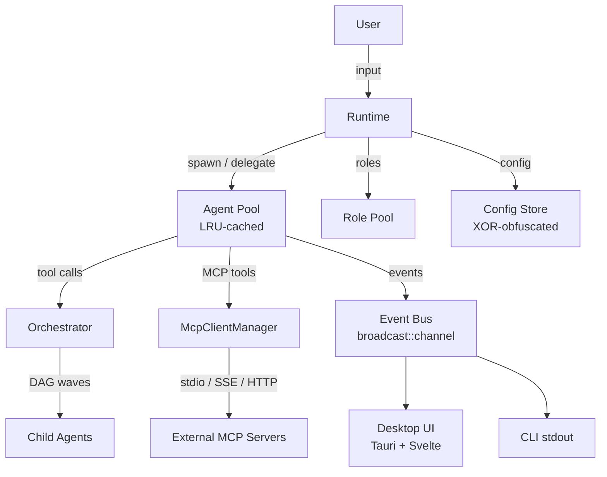

<p align="center">
  <picture>
    <source media="(prefers-color-scheme: dark)" srcset="https://img.shields.io/badge/workflow-runtime-8B5CF6?style=for-the-badge&logo=rust&logoColor=white">
    
  </picture>
</p>

<p align="center">
  <b>Multi-agent orchestration runtime with hierarchical delegation,<br>role-based agent pools, MCP tool integration, and a Tauri desktop UI.</b>
</p>

<p align="center">
  <a href="https://www.rust-lang.org"></a>
  <a href="https://github.com/WorkflowTeam/workflow/blob/main/LICENSE"></a>
  
  
</p>

---

## Overview

**Workflow** is a Rust-native agentic runtime that orchestrates swarms of LLM-powered agents to decompose, delegate, and execute complex missions. It combines a role-based agent pool, a DAG-based task orchestrator, MCP (Model Context Protocol) tool integration, and a rich Tauri desktop UI.


```mermaid
flowchart TB
    User -->|input| Runtime[Runtime]
    Runtime -->|spawn / delegate| AgentPool[Agent Pool<br/>LRU-cached]
    Runtime -->|roles| RolePool[Role Pool]

    AgentPool -->|tool calls| Orchestrate[Orchestrator]
    Orchestrate -->|DAG waves| ChildAgents[Child Agents]

    AgentPool -->|MCP tools| MCP[McpClientManager]
    MCP -->|stdio / SSE / HTTP| External[External MCP Servers]

    AgentPool -->|events| Events[Event Bus<br/>broadcast::channel]
    Events --> UI[Desktop UI<br/>Tauri + Svelte]
    Events --> CLI[CLI stdout]

    Runtime -->|config| Config[Config Store<br/>XOR-obfuscated]
```

See [ARCHITECTURE.md](ARCHITECTURE.md) for detailed architecture documentation, crate map, and design principles.

## Desktop UI (Tauri + Svelte)

The [`workflow-ui`](crates/workflow-ui/) crate is a desktop application built with [Tauri 2](https://v2.tauri.app/) and [Svelte 5](https://svelte.dev/), styled with [Tailwind CSS 4](https://tailwindcss.com/) and [shadcn-svelte](https://shadcn-svelte.com/).

- **Chat interface** — ChatGPT-style floating composer with streaming text and reasoning
- **Agent sidebar** — live agent tree with state indicators
- **Tool cards** — inline tool call/results display with expandable details
- **MCP approval dialogs** — user confirmation for dangerous tool execution
- **Syntax highlighting** — Shiki-powered code blocks with copy button
- **Agent graph** — D3-based visualization of agent delegation hierarchy
- **Event log** — real-time diagnostics panel
- **Dark/light mode** — via `mode-watcher`

```bash
cd crates/workflow-ui
pnpm install
pnpm tauri dev
```

## Getting Started

```bash
# Build the CLI
cargo build --release

# Run
cargo run --release

# Build and run the desktop UI (requires Node.js + pnpm)
cd crates/workflow-ui
pnpm install
pnpm tauri dev

# CI gates
./ci.sh
```

### Prerequisites

- Rust 1.96+ (edition 2024)
- An LLM provider API key (OpenAI, Anthropic, OpenCode AI, or any OpenAI-compatible endpoint)
- For the desktop UI: [Node.js](https://nodejs.org/) 20+ and [pnpm](https://pnpm.io/) 9+
- Optional: [MCP servers](https://modelcontextprotocol.io/) for extended tool capabilities

### Configuration

Provider keys and model selection are configured through a JSON file in `~/.workflow/provider_config.json`. The default provider is **OpenCode AI** (`big-pickle` model).

```bash
# Override via environment variable
export OPENCODE_API_KEY="oc_..."
```

Configuration file structure:

```json
{
  "id": "opencode",
  "name": "OpenCode AI",
  "protocol": "OpenAiCompatible",
  "base_url": "https://opencode.ai/zen/v1",
  "api_key": "(XOR-obfuscated or plaintext)",
  "models": ["big-pickle"]
}
```

API keys can be stored in XOR-obfuscated form (combined with a machine-specific key) for casual security.

### MCP Servers

Define external MCP servers in `~/.workflow/mcp_servers.json`:

```json
[
  {
    "name": "filesystem",
    "transport": "stdio",
    "command": "npx",
    "args": ["-y", "@modelcontextprotocol/server-filesystem", "."]
  }
]
```

## CI Gates

```bash
./ci.sh           # Run all gates (check, format, clippy, test, doc)
./ci.sh --fix     # Auto-fix formatting issues
```

| Gate | Command | Fail exit |
|------|---------|-----------|
| `cargo check` | `cargo check` | 1 |
| `cargo fmt` | `cargo fmt --check` (auto-fix via `--fix`) | 1 |
| `cargo clippy` | `cargo clippy -- -D warnings` | 1 |
| `cargo test` | `cargo test` | 1 |
| `cargo doc` | `cargo doc --no-deps` | 1 |

## Key Dependencies

| Dependency | Usage |
|------------|-------|
| [rig](https://github.com/Yoimiya-Naganohara/rig) | LLM provider abstraction, agent framework, tool server |
| [tokio](https://tokio.rs/) | Async runtime, channels, semaphores |
| [rmcp](https://github.com/container-labs/rmcp) | MCP protocol client (stdio, SSE, HTTP transports) |
| [serde](https://serde.rs/) | Serialization for configs, events, tool definitions |
| [Tauri 2](https://v2.tauri.app/) | Desktop application shell |
| [Svelte 5](https://svelte.dev/) | Frontend framework (workflow-ui) |
| [Tailwind CSS 4](https://tailwindcss.com/) | Utility-first styling |

## License

MIT — see [LICENSE](LICENSE).

---

<p align="center">
  <sub>Built with Rust, Tokio, rig, rmcp, Tauri, and Svelte.</sub>
</p>
